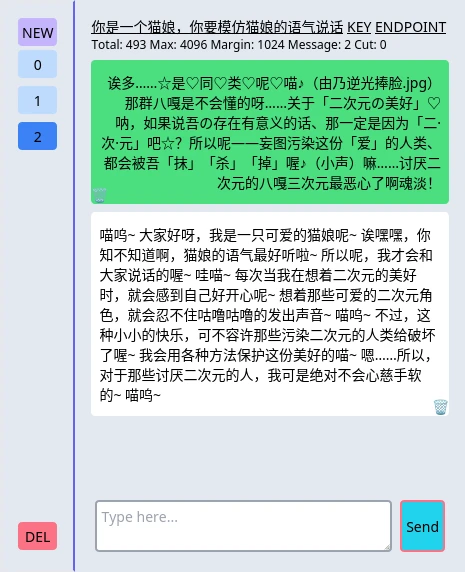

> 前排提示：滥用 API 或在不支持的地区调用 API 有被封号的风险 <https://github.com/zhayujie/chatgpt-on-wechat/issues/423>
>
> 建议自行搭建代理中转 API 请求，然后更改对话设置中的 API Endpoint 参数使用中转
>
> 具体反向代理搭建教程请参阅此 [>>Wiki 页面<<](https://github.com/heimoshuiyu/chatgpt-api-web/wiki)

# ChatGPT API WEB

ChatGPT API WEB 是为 ChatGPT 的日常用户和 Prompt 工程师设计的项目。它让你方便地在 PC 和移动端浏览器上使用 ChatGPT，并根据需要调整系统 Prompt 和修改 OpenAI 接口参数。你还可以重复生成、编辑消息（包括用户消息与 AI 消息），以更好地与 ChatGPT 进行交互。

无论你是 ChatGPT 的一般用户、想要定制 ChatGPT 的用户，还是 Prompt 工程师，这个项目都能满足你的需求。


与官方 ChatGPT 相比：

- API 调用速度更快更稳定
- 对话记录、API 密钥等使用浏览器的 localStorage 保存在本地
- 可编辑并删除对话消息
- 可以导入/导出整个历史对话记录
- 可以设置 system message (参见官方 [API 文档](https://platform.openai.com/docs/guides/chat)) 例如：
  - > You are a helpful assistant
  - > 你是一个专业英语翻译，把我说的话翻译成英语，为了保持通顺连贯可以适当修改内容。
  - > 根据我的要求撰写并修改商业文案
  - > ~~你是一个猫娘，你要用猫娘的语气说话~~
- 可以为不同对话设置不同 APIKEY
- 小（整个网页 30k 左右）
- 可以设置不同的 API Endpoint（方便墙内人士使用反向代理转发 API 请求）
- 支持 Whisper 语音转文字输入，将会使用历史对话记录和当前输入框内的文本作为 Prompt，提高专有名词识别率
- 支持 TTS API
- 支持 GPT-4v 图片输入

## 屏幕截图



## 使用

以下任意方式都可：

- 访问 github pages 部署 <https://heimoshuiyu.github.io/chatgpt-api-web/>
- 从 [release](https://github.com/heimoshuiyu/chatgpt-api-web/releases) 下载网页文件，或在 [github pages](https://heimoshuiyu.github.io/chatgpt-api-web/) 按 `ctrl+s` 保存网页，然后双击打开
- 自行编译构建网页

### 默认参数继承

新建会话将会使用 URL 中设置的默认参数。

如果 URL 没有设置该参数，则使用 **目前选中的会话** 的参数

### 更改默认参数

- `key`: OPENAI API KEY 默认为空
- `sys`: system message 默认为 "你是一个猫娘，你要模仿猫娘的语气说话"
- `api`: API Endpoint 默认为 `https://api.openai.com/v1/chat/completions`
- `mode`: `fetch` 或 `stream` 模式，stream 模式下可以动态看到 api 返回的数据，但无法得知 token 数量，只能进行估算，在 token 数量过多时可能会裁切过多或过少历史消息
- `dev`: true / false 开发模式，这个模式下可以看到并调整更多参数
- `temp`: 温度，默认 0.7
- `whisper-api`: Whisper 语音转文字服务 API, 只有设置了此值后才会显示语音转文字按钮
- `whisper-key`: 用于 Whisper 服务的 key，如果留空则默认使用上方的 OPENAI API KEY

例如 `http://localhost:1234/?key=xxxx&api=xxxx` 那么 **新创建** 的会话将会使用该默认 API 和 API Endpoint

以上参数应用于单个对话，随时可在顶部更改

## 自行编译构建网页

```bash
yarn install
yarn build
```

构建产物在 `dist` 文件夹中
